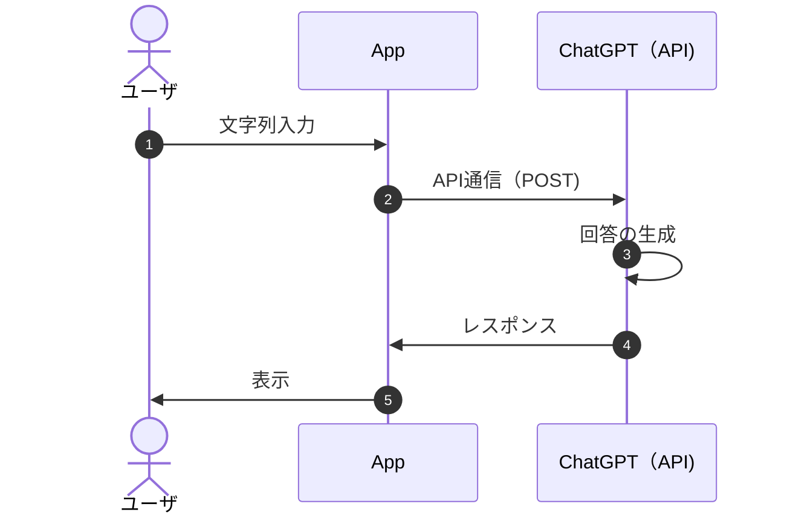
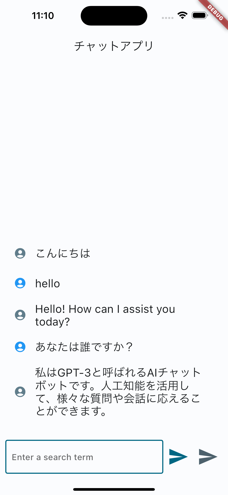

# flutter_tutorial

flutter project

```mermaid
sequenceDiagram
autonumber

actor u as ユーザ

participant app as App
participant api as ChatGPT（API)

u ->> app: 文字列入力

app ->> api: API通信（POST)

api ->> api: 回答の生成

api ->> app: レスポンス

app ->> u: 表示
```

